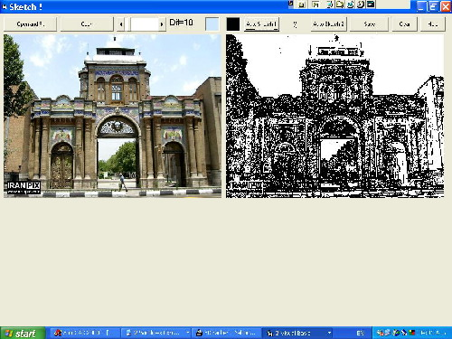



## Edge Sketch \- ReWrite

### Description

'This code is a rewrite for the code that appeared in Planet Source Code

'http://www.planet-source-code.com/vb/scripts/showcode.asp?txtCodeId=55153&lngWId=1

'The original code was very poorly written and as a result was painfully slow,

'difficult to use, understand and generally substandard

'Original Programmer : Mahdi Shakouri rad, Mahdi_Rad@yahoo.com

'Changes:

'1. Use drag/drop on the pictureboxes so that the results can easily be "scrolled"

'onto the screen for analysis. Some times objects will not fit on the available

'real estate - have some respect for your potential user!

'2. Use "beginner" APIs - GetPixel, SetPixel for speed

'3. Place RGB calcs in loops - do not exit loop to an outside subprocedure when

'parsing a bitmap

'4. Use industry standard notation for variables. Precede a string with "s",

'a Long with "l" etc.

'5. Indent and use spacing - this is the most valuable productivity tool that you

'will ever need to learn, so start now!

'6. Use Long variables unless Singles are required. RAM "savings" are no longer

'necessary, but the speed enhancements are!

'7. Develop discipline - Stand out - do not be proud of "lazy" code.
 
### More Info
 

             |
---                |---
**Submitted On**   |2004-07-24 16:35:32
**By**             |[Ed Porter](https://github.com/Planet-Source-Code/PSCIndex/blob/master/ByAuthor/ed-porter.md)
**Level**          |Beginner
**User Rating**    |5.0 (15 globes from 3 users)
**Compatibility**  |VB 6\.0
**Category**       |[Graphics](https://github.com/Planet-Source-Code/PSCIndex/blob/master/ByCategory/graphics__1-46.md)
**World**          |[Visual Basic](https://github.com/Planet-Source-Code/PSCIndex/blob/master/ByWorld/visual-basic.md)
**Archive File**   |[Edge\_Sketc1773787242004\.zip](https://github.com/Planet-Source-Code/ed-porter-edge-sketch-rewrite__1-55159/archive/master.zip)

